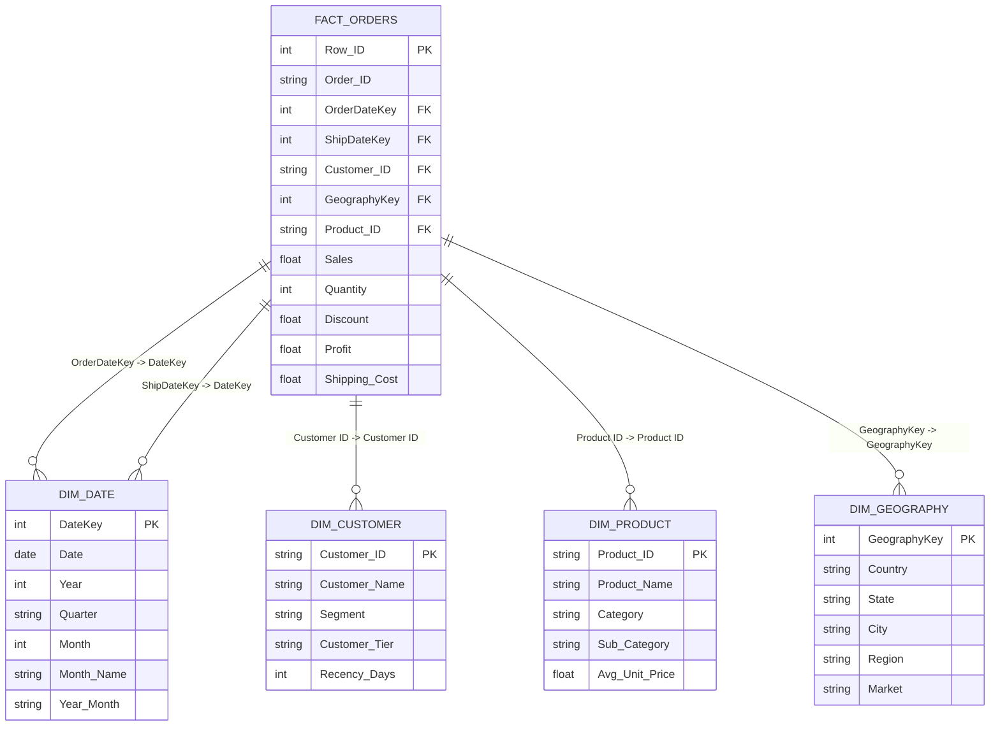

# Global Superstore - Executive Sales & Profitability Intelligence Suite

[](https://powerbi.microsoft.com/)
[](DAX_Measures.dax)
[](data_pipeline.py)
[](index.html)
[](LICENSE)

An enterprise-grade **Business Intelligence, DAX modeling, and Sales Analytics Suite** built on the **Global Superstore** dataset (51,290 transactions across 147 countries, 4 fiscal years, and $12.64M in gross sales).

---

## 📊 Executive Scorecard & Macro Results (2011 – 2014)

```
┌────────────────────────────────────────────────────────────────────────────────────────┐
│                                    MACRO SCORECARD                                     │
├────────────────────────────────────────────────────────────────────────────────────────┤
│  Gross Revenue:         $12,642,501.91    │  Total Unique Orders:        25,035        │
│  Net Profit:            $1,467,457.29     │  Active Customer Base:       1,590         │
│  Net Profit Margin:     11.61%            │  Catalog Product Count:      10,292        │
│  Total Units Sold:      178,312 units     │  Total Shipping Cost:        $1,352,815.70 │
│  Average Order Value:   $504.99           │  Avg Order-to-Ship Cycle:    3.97 Days     │
│  Identified Profit Leak: $521,419.00      │  Tables Sub-Category Loss:   -$64,083.39   │
└────────────────────────────────────────────────────────────────────────────────────────┘
```

---

## 🔍 Critical Business Findings & Profit Leak Root-Causes

### 1. Structural Deficit in "Tables" Sub-Category
Across 17 product sub-categories, **Tables is the sole loss-making line enterprise-wide**:
- **Gross Revenue:** $757,041.90 | **Units Sold:** 3,083
- **Net Profit:** **-$64,083.39** (Profit Margin: **-8.46%**)
- **Root Cause:** A heavy average discount rate of **29.07%** combined with high freight fulfillment costs for bulky furniture completely erodes unit margins.

### 2. Severe Margin Destruction from Emerging Market Discounting
Discretionary discounting policies in several international markets created catastrophic margin erosion:
- **Turkey (EMEA):** -$98,447 Profit on $108k sales (Avg discount: **60.0%** | Margin: **-90.73%**)
- **Nigeria (Africa):** -$80,751 Profit on $54k sales (Avg discount: **70.0%** | Margin: **-148.57%**)
- **Netherlands (EU):** -$41,070 Profit on $77k sales (Avg discount: **48.2%** | Margin: **-52.98%**)
- **Honduras (LATAM):** -$29,482 Profit on $90k sales (Avg discount: **40.7%** | Margin: **-32.71%**)

> **Actionable Impact:** Capping regional discounts at 15–20% will immediately recover over **+$220,000 in net profit** annually with zero additional operating cost.

---

## 🛠️ Identified Flaws in Legacy Visuals & How They Were Fixed

| Category | Legacy Flaw / Mistake | Senior BI Analyst Solution |
| :--- | :--- | :--- |
| **KPI Metrics** | `Sum(Discount)` added up percentages (e.g. 7,333.32%) — mathematically nonsensical. | Implemented `[Average Discount %]` and `[Weighted Average Discount %]`. |
| **Data Model** | Single flat 51k-row table without normalized dimensions or dedicated Calendar. | Built 5-table **Star Schema** (`Fact_Orders`, `Dim_Date`, `Dim_Customer`, `Dim_Product`, `Dim_Geography`). |
| **City/Country Charts** | Clustered bar charts with 3,600+ cities jammed together with no readability. | Replaced with dynamic **Top 10 / Bottom 10 Pareto charts** and Regional Market Hubs. |
| **Area Chart** | Continuous `Profit` used as the category axis for Sales — mathematically broken. | Replaced with true Monthly Time Series (Dual-Axis Sales & Profit with YoY lines). |
| **Time Intelligence** | Zero YoY / MoM calculations or growth comparisons. | Engineered full Time Intelligence DAX suite (`SAMEPERIODLASTYEAR`, `TOTALYTD`, `YoY Growth %`). |

---

## 🏗️ Dimensional Star Schema Architecture



---

## 📐 Enterprise DAX Measures Library (Excerpts)

All 25+ production DAX formulas are cataloged in [`DAX_Measures.dax`](DAX_Measures.dax):

```dax
-- 1. Core Financial Measures
[Total Sales] = SUM(Fact_Orders[Sales])
[Total Profit] = SUM(Fact_Orders[Profit])
[Profit Margin %] = DIVIDE([Total Profit], [Total Sales], 0)
[Average Order Value (AOV)] = DIVIDE([Total Sales], [Total Orders], 0)

-- 2. Time Intelligence (YoY & MoM)
[Sales PY] = CALCULATE([Total Sales], SAMEPERIODLASTYEAR(Dim_Date[Date]))
[Sales YoY Growth %] = DIVIDE([Total Sales] - [Sales PY], [Sales PY], 0)
[Profit PY] = CALCULATE([Total Profit], SAMEPERIODLASTYEAR(Dim_Date[Date]))
[Profit YoY Growth %] = DIVIDE([Total Profit] - [Profit PY], [Profit PY], 0)
[Sales YTD] = TOTALYTD([Total Sales], Dim_Date[Date])

-- 3. Profit Leak & Governance
[Average Discount %] = AVERAGE(Fact_Orders[Discount])
[Loss Making Orders Count] = CALCULATE(DISTINCTCOUNT(Fact_Orders[Order ID]), Fact_Orders[Profit] < 0)
[Total Profit Lost ($)] = CALCULATE(ABS(SUM(Fact_Orders[Profit])), Fact_Orders[Profit] < 0)
```

---

## 📈 Year-Over-Year Macro Growth (2011–2014)

| Fiscal Year | Gross Sales ($) | YoY Sales % | Net Profit ($) | YoY Profit % | Profit Margin % | Total Orders |
| :---: | :---: | :---: | :---: | :---: | :---: | :---: |
| **2011** | $2,259,451 | — | $248,941 | — | 11.02% | 4,440 |
| **2012** | $2,677,439 | **+18.50%** | $307,415 | **+23.49%** | 11.48% | 5,343 |
| **2013** | $3,405,746 | **+27.20%** | $406,935 | **+32.37%** | 11.95% | 6,721 |
| **2014** | $4,299,866 | **+26.25%** | $504,166 | **+23.89%** | 11.73% | 8,531 |

---

## 🚀 Interactive Web Analytics Studio & Report Viewer

This repository includes a standalone, high-performance web dashboard application replicating and enhancing Power BI capabilities:
- **Interactive Multi-Dimensional Filtering:** Real-time slicers for Fiscal Year (2011–2014), Market Region, Product Category, and Customer Segment.
- **Dynamic KPI Scorecards:** Gross Sales, Net Profit, Margin %, AOV, and Deficit Lines with automatic status indicators.
- **5 Analytical Modules:**
  1. *Executive Overview & Financial Trends* (Monthly trajectory, category donut, YoY matrix).
  2. *Geographic & Market Intelligence* (Market Hubs, Top 10 profitable vs Bottom 10 loss-making nations).
  3. *Category & Profit Leaks Diagnostic* (Tables sub-category loss audit, discount correlation scatter).
  4. *Shipping Economics & Customer Dynamics* (Ship mode volume, cost progression, turnaround days).
  5. *DAX Measures & Star Schema Explorer* (Interactive data architecture & copyable DAX code).

### How to Launch the Web Dashboard:
```bash
# 1. Generate Star Schema and analytical JSON
python data_pipeline.py

# 2. Start local web server
python -m http.server 8080

# 3. Open in any browser
http://localhost:8080
```

---

## 📁 Repository Structure

```text
├── Global Superstore - Orders.csv     # Raw transactional dataset (51,290 rows)
├── global_sales_dashboard.pbix        # Production Power BI Report file
├── data_pipeline.py                   # Automated Star Schema ETL & analytics pipeline
├── DAX_Measures.dax                   # Complete library of 25+ enterprise DAX measures
├── dashboard_data.json                # Pre-aggregated data payload for interactive app
├── index.html                         # Live Executive Analytics Studio (Web UI)
├── style.css                          # Modern glassmorphic dark theme stylesheet
├── app.js                             # Interactive chart rendering & dynamic filtering engine
├── .gitignore                         # Standard git ignore rules
├── data_model/                        # Star Schema normalized CSV tables
│   ├── Dim_Date.csv
│   ├── Dim_Customer.csv
│   ├── Dim_Product.csv
│   ├── Dim_Geography.csv
│   └── Fact_Orders.csv
└── reports/
    └── Executive_Business_Report.md   # 10-page executive strategic playbook & recommendations
```

---

## 💡 Strategic Executive Recommendations

1. **Enforce Global Discount Guardrails:** Cap discretionary sales discounts at 15% to eliminate $220k+ in emerging market losses (Turkey, Nigeria, Netherlands).
2. **Re-engineer "Tables" Product Line:** Implement a 12% price adjustment, delist negative-margin SKUs, and apply a mandatory bulky freight surcharge.
3. **Target High-CLV B2B Corporate Clients:** Corporate & Home Office accounts demonstrate higher margin stability (11.5%–12.0%) and repeat purchasing.
4. **Logistics Optimization:** Migrate eligible low-priority shipments to Standard Class (5-day cycle) to reduce expedited carrier surcharges.

---

## 👤 Author & Contribution
- **Author:** Senior Business Intelligence & Commercial Strategy Specialist
- **Contact / GitHub:** [@Abhiram1213](https://github.com/Abhiram1213)
